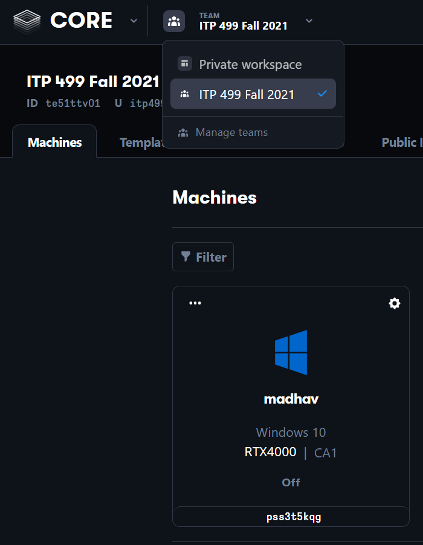
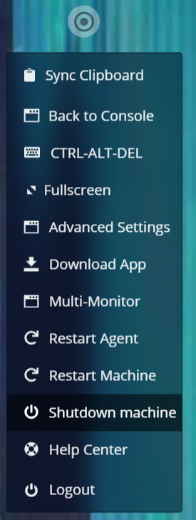

# Connecting to Your VM

You already should've received an invite to join the Paperspace Team via your USC email, if you've not, please let me know. The email will guide you through creating your account, but you still need to manually [accept the team invite](https://support.paperspace.com/hc/en-us/articles/360014816694-Joining-a-Paperspace-Team) under "Manage Teams". Once you accept your invite, post on the "VM Creation Requests" thread on Piazza, and I will create a VM machine for you.

1. Go to the [Paperspace site](https://www.paperspace.com/) and sign in using your USC email
2. In the console, make sure you select "CORE" and the ITP 499 Fall 2021 team (yes, the team is still called this even though it's ITP 438 in a different semester):
   
3. You should have access to a VM with a name corresponding to your USC account name. If you don't, it means I haven't set it up yet, in which case please post a request on the Piazza thread for VMs.
4. Click on the VM and then click the startup button that shows up. It will take a minute or two to start up for this first time.
5. Once the VM finishes startup, you should be in Windows 10
6. Near the top right corner you'll see a icon with some concentric circles. Click on this to see your Paperspace options. You should go into "Advanced Settings" and enable "Gamer Mode"

{: .warn }
Paperspace bills by usage. In order to make sure that you do not have extreme overages, you ***MUST*** shut down your VM instance when you are not actively using it. Get in the habit of always shutting down when you're done with your session. If you end up with overages you may lose VM privileges for the semester, in which case you would have to do all development on your own machine instead.

To shut down your VM, you can use the Paperspace menu and select "Shutdown machine." Make sure to always do this when you are done working, as noted in the warning above:

You can also shut down your VM using the normal shut down option in the Start Menu.

Then, return to the console view with "Back to Console" and confirm that your Machine is in the "Off" state.

## Setting up Parsec

Although you can use the Paperspace client to connect to your VM for development, it can sometimes be laggy which makes it annoying to use. Because of this, we recommend that you use Parsec to connect to your VM.

Now you're ready to [Set up Perforce](00-02.html)
