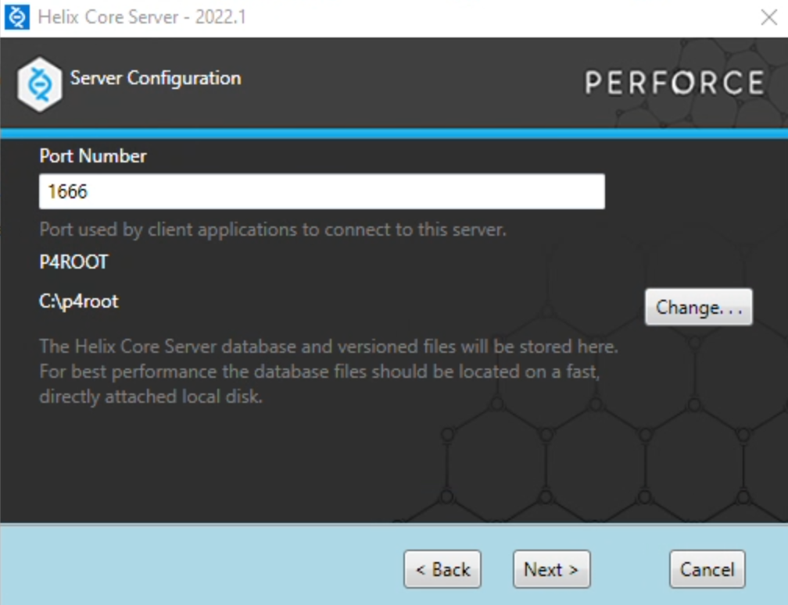

# Setting Up Perforce

Like Git, Perforce is a source control system. Perforce handles large binary files in a much more effective way than Git does, and for this reason Perforce is a very popular choice for game developers. While Unreal Engine does have some integration with Git, its integration with Perforce is much more robust as Epic Games uses Perforce internally.

Unfortunately, Perforce does not have a free site like GitHub which can host your repository. So, you'll be setting up a Perforce server on your VM.

## Installing P4D (Perforce Server)

Normally you would download the Perforce Server (now branded as Helix Core Server) from [here](https://www.perforce.com/downloads), but because it requires you to register an email, I've included the installer for the server and the client in the Downloads directory of your VM.

1. Create a `C:\p4root` folder
2. Run the `helix-core-server-x64.exe` installer
3. In the Server Configuration step, leave it as port 1666 and set P4ROOT to point to `C:\p4root`:
   
4. In the Client Configuration step, the username doesn't matter (as it won't actually make a user with that name).
5. Finish the installation

## Installing P4V (Perforce Client)

1. Now run the p4v installer in the Downloads directory (`p4vinst64.exe`)
2. Just keep all the default options for the installer
3. After the installation finishes, P4V will automatically run and you'll see the "Open Connection" dialog.

## Perforce Setup Tutorial

{: .danger }
When you setup your Perforce server, you will need to setup an admin user and password for your server. You should save your login information somewhere in a local text file so you do not forget it, because Perforce will ask you for the password every 24 hours. Do not use your USC password. If you lose your Perforce password, it is impossible to retrieve and you will have to nuke your server and start over again.

The process of setting up your Perforce is a bit involved. You are going to follow a [tutorial](https://allarsblog.com/2017/04/05/populating-perforce-with-an-unreal-engine-source-build/) to setup your server. However, there are a few steps that are slightly different from the tutorial, so please read over these notes closely before starting the tutorial:

- **Start** at "Creating Your User Account" and **stop** at "Putting The Unreal Engine Build On Perforce"

- Use a password that meets the requirements or write it down somewhere -- if you forget your password it's a pain to regain access

- You can just leave the server address as the port, which is `1666`

- **Skip** the "Build The Unreal Engine From Source Code" step for now as we'll be doing that later, after our Perforce workspace is setup

- When you need to select a Workspace root, use `C:\Work` as your root

- We're going to use a slightly different typemap from what the tutorial says. Use this typemap ***exactly*** (don't change any text in it):
  ```
  # Perforce File Type Mapping Specifications.
  #
  #  TypeMap:	a list of filetype mappings; one per line.
  #		Each line has two elements:
  #
  #  		Filetype: The filetype to use on 'p4 add'.
  #
  #  		Path:     File pattern which will use this filetype.
  #
  # See 'p4 help typemap' for more information.
  
  TypeMap:
  	binary+S2w //depot/....exe
  	binary+S2w //depot/....dll
  	binary+S2w //depot/....lib
  	binary+S2w //depot/....app
  	binary+S2w //depot/....dylib
  	binary+S2w //depot/....stub
  	binary+S2w //depot/....ipa
  	binary //depot/....bmp
  	text //depot/....ini
  	text //depot/....config
  	text //depot/....cpp
  	text //depot/....h
  	text //depot/....c
  	text //depot/....cs
  	text //depot/....m
  	text //depot/....mm
  	text //depot/....py
  	binary+S3l //depot/....uasset
  	binary+S3l //depot/....umap
  	binary+S3l //depot/....upk
  	binary+S3l //depot/....udk
  	binary+S3l //depot/....ubulk
  	text+w //depot/....deps.json
  	text+w //depot/....runtimeconfig.json
  	text+w //depot/....runtimeconfig.dev.json
  	text+w //depot/....dll.config
  	text+w //depot/...UnrealBuildTool.xml
  	text+w //depot/....csproj.References
  	text+w //depot/....modules
  	text+w //depot/....target
  	text+w //depot/....version
  ```

- We're going to use a slightly different `.p4ignore` from what the tutorial says. Use this: 

  ```
  Saved/
  Intermediate/
  DerivedDataCache/
  !UnrealEngine/Engine/Source/Developer/DerivedDataCache
  *.pdb
  obj/
  *.vcxproj
  *.sln
  *-Debug.*
  FileOpenOrder/
  *.patch*
  .vs/
  Log.txt
  Log_*.txt
  ```

Now that you've reviewed the differences, [start on the tutorial here](https://allarsblog.com/2017/04/05/populating-perforce-with-an-unreal-engine-source-build/).

{: .note }
The biggest difference between our typemap and the one in the tutorial is that I changed the Unreal asset types (uasset, umap, etc.) from `binary+l` to `binary+S3l`. This means our server is only going to save the prior 3 revisions of each of those files, which will save a significant amount of space if we keep changing them. However, for a real project you likely would want to use `binary+l` to be sure to preserve the whole history (or at least something like `S10l` to have a longer history). It also adds several additional files as `text+w` as they are build products that we want to be locally writable so that programmers can build locally without issue (and at the same time we can commit those files to Perforce for the non-programmers).

Once you get to the "Putting The Unreal Engine Build on Perforce" step, you're ready to move onto [Compiling and Running Unreal](00-03.html).
