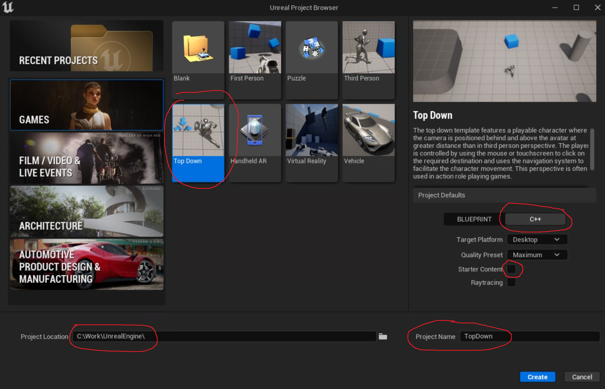

# Compiling and Running Unreal

Although Epic does have a Perforce server you can use for direct access to their ground truth version, access is only provided to registered UDN developers. However, the source code is also mirrored on GitHub. To access the source code you need to link your Epic Games account to your GitHub account, as [outlined here](https://www.unrealengine.com/en-US/ue4-on-github).

1. Once you have access to GitHub, you want the code from the `ue5-early-access` branch: [https://github.com/EpicGames/UnrealEngine/tree/ue5-early-access](https://github.com/EpicGames/UnrealEngine/tree/ue5-early-access).
2. From here, you want to download a ZIP file of the source:

3. Install [7-Zip](https://www.7-zip.org/) as Windows Explorer Unzip is terrible
4. Move the ZIP file into your `C:\Work` directory
5. Right click on the ZIP file and say 7-Zip>Extract Here
6. Once the extract finishes (it takes about 1-2 minutes), you can delete the ZIP file
7. Now you'll have a `C:\Work\UnrealEngine-ue5-early-access directory`. Rename this directory to just `UnrealEngine`.
8. Inside this directory you should see various files like `Setup.bat`, `GenerateProjectFiles.bat`, and so on.

## Adding a Windows Security Exclusion

Antivirus programs get very unhappy with the large amount of unfamiliar files (and binary files) we'll be making. We need to add an exclusion or it will slow things down significantly.

1. Open up Windows Security
2. Under "Virus & threat protection" select "Manage Settings.
3. Scroll down to Exclusions and click "Add or remove exclusions":

4. From here, add a Folder exclusion for `C:\Work` as well as for `C:\p4root`

## Running Setup.bat and GenerateProjectFiles.bat

1. In the `C:\Work\UnrealEngine` directory, run `Setup.bat`. It will take about 5-10 minutes to finish. What this does is download binary/data dependencies of the engine which are not included in the GitHub repository. You'll only need to run this once on this initial setup, as we'll be committing these files to Perforce.
2. You'll get a couple of dialog boxes asking you to confirm you want to make the changes, and click yes.
3. Once `Setup.bat` finishes, run `GenerateProjectFiles.bat`. This will only take a 10-15 seconds to finish, and will generate a Visual Studio solution file with the name `UE5.sln`.

## Compiling Unreal for the First Time

Unreal is a massive codebase, and the very first time you do a clean build from source, it will take quite some time to compile -- about 1 hour and 40 minutes on the VM. Although you don't have to do anything while it compiles, make sure to keep your Paperspace app visible so you can see when the build is complete. You do not want to have hours of overage on your VM because you left it running and forgot that you were compiling. If you aren't going to be able to monitor it right now, I'd suggest shutting down the VM for now and resuming this step later.

1. Double-click on `UE5.sln` to open it in Visual Studio.
2. In the solution explorer, right click on UE5 and select "Set as Startup Project":

3. Now right click on UE5 again, and this time select "Build" which will kick off the build
4. Set a timer on your phone for 1 hour and 40 minutes so you remember to come back to your VM when the build is done.

{: .danger }
Never use "Build Solution" in an Unreal Project as this will compile several additional executables that you rarely need to compile, and as a result will take a very long time. Always just right click on the project (either UE4 or your game project) and build that way, or alternatively press the play button, which will build your current startup project prior to running.

## Running Unreal for the First Time

Once the build is finished, you can click the green Play button in Visual Studio to run Unreal. You'll see a splash window in the middle of the screen and it'll show the percent progress loading and that it's compiling shaders. It will take 10-15 minutes to start this first time.

Once the shaders compile, you'll see the Unreal Project Browser. In here, you want to:

- Select the "Top Down" template
- Under Project Defaults:
  - Select C++
  - Uncheck "Starter Content"
  - Make sure "Raytracing" is unchecked if it's not already
- Set the Project Location to `C:\Work\UnrealEngine\`
- Set the Project Name to "TopDown"

It should look like this:

After a few seconds this will update the UE5.sln file and you'll get a message from Visual Studio telling you the UE5 solution has been modified. Click the "Reload" button which will reopen the solution file.

Once it's reloaded, you'll notice in the solution explorer there's now a Games filter under which you'll see TopDown. Right click on TopDown and change it to be the startup project now (which will make it bold):

## Running TopDown

Now hit the Play button with TopDown selected as the startup project. The compilation and initial load will be quite fast since there's not very much game project-specific code yet. Loading into the editor will look like this:

It will take a few minutes to finish compiling shaders. In the meantime, you can practice navigating in the editor. Here are the basics:

- You can left-click to select actors in the editor viewport. When selected, you will see details of that actors and any components in on the Details panel to the right
- The World Outliner in the top right allows you to pick and search objects by their names, as well as organize them
- If you hold down the right mouse button, you can move the mouse to rotate the camera and use WASD to pan the camera
- You can read more about the default interface in Unreal [here](https://docs.unrealengine.com/4.26/en-US/BuildingWorlds/LevelEditor/#thedefaultinterface). Although this documentation is specifically for Unreal 4, the editor is almost the same in Unreal 5, except:
  - The Place Actors panel is not shown by default anymore. Instead, you're encouraged to use the "Create" button in the top left corner to add whatever you want. However, if you prefer to use the "Place Actors" panel you can enable it with the option at the bottom of the Create menu
  - The "Content Browser" is now hidden by default in the "Content Drawer". To show or hide it, press **CTRL+Space**

You can also play the top down template in editor while waiting for the shaders to finish compile. Click the green "Play" button and try it out! Use left mouse click to click where you want the mannequin character to move. When you've had your fill, press **ESC** to exit the "Play-in-Editor" (or "PIE") session.

Once your shaders finish compiling, save the map and close the editor. Once the editor closes, also exit out of Visual Studio. You're now ready to [Commit to Perforce](00-04.html).
