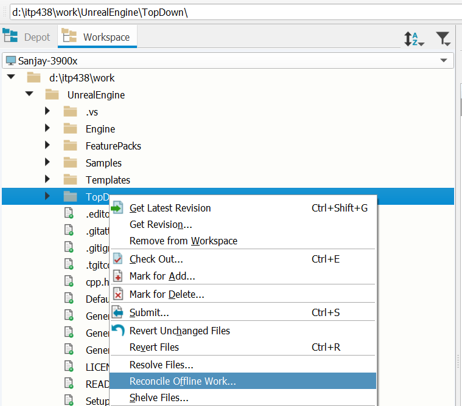
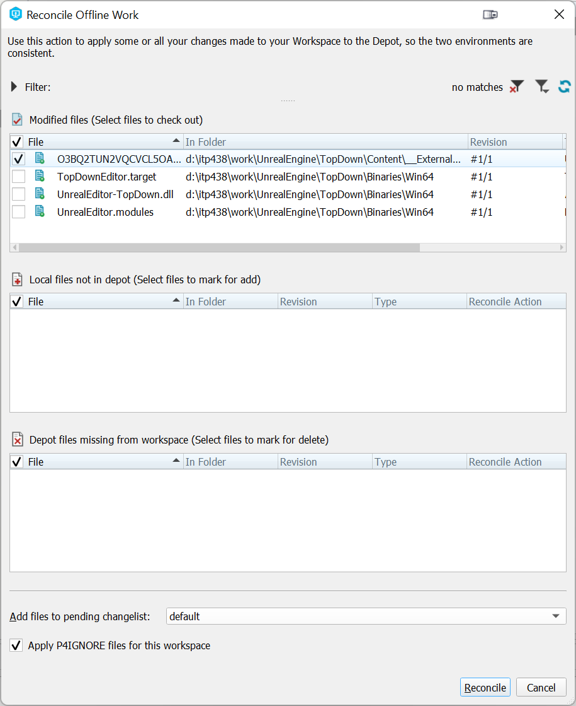

# (Optional) Setting Up a Local Machine

Keep in mind that Unreal 5 requires a fairly powerful machine for development. As mentioned before, the minimum specs are roughly:

- Windows 10 (although the editor does run on Mac and Linux as well, I don't recommend it)
- 8-core CPU
- 32 GB of system RAM
- Nvidia GTX 1080 or AMD RX Vega 64 w/ 8GB of VRAM
- 250+ GB free space on an SSD

If your machine doesn't meet these specs, it probably is not worth setting up your local machine, and instead you should just stick to using your VM, which you've already setup!

## Requesting a Static IP

To be able to connect to your VM's Perforce server remotely, you need a Static IP address that doesn't change every time you turn off your VM. To get one assigned to your VM, please post on the corresponding Piazza thread to request one.

Once you have a Static IP, on the Paperspace console (which shows your machine), go to the settings for your VM and it will say what your Static Public IP address is. Keep that number handy.

## Local: Install Visual Studio 2022

You need to install [Visual Studio 2022](https://visualstudio.microsoft.com/downloads/) (community edition is fine). You need to install the following workloads:

- Desktop Development with C++
- Game Development with C++
- .NET desktop development
- Universal Windows Platform development

Additionally, under "Individual components" you should also add ".NET Core 3.1 Runtime (LTS)".

If you've previously installed Visual Studio 2022, you can go into the installer and "Modify" to add any workflows you're missing.

{: .note }
You may wonder why you need .NET/C# workflows. The reason is a decent amount of the support tooling for Unreal is written in C#, and so you typically need these workflows for everything to build properly.

## Local: Install P4V

You also need to install [P4V](https://www.perforce.com/downloads/helix-visual-client-p4v) locally. You can leave everything on the default settings.

## VM: Configuring Firewall Rules

Start up your Paperspace VM, and:

1. Open Windows Security
2. Go to "Firewall & network protection"
3. Select "Advanced settings"
4. In the Windows Defender Firewall with Advanced Security window, select "Inbound Rules" on the left column and "New Rule..." on the right:
   
5. For Rule Type, select "Port" and click Next
6. For Protocol and Ports, under "Specific Local Port" type 1666 and click Next
7. Click Next past Action and Profile
8. For Name, just name it "Perforce Server"

## Local: Syncing to Perforce

Your VM also needs to be running for the duration of this step. Keep in mind this initial sync will need to download a lot of data, which means how long it'll take will depend on your connection to some degree (although outbound connections from the VM are limited to 100Mbps, so you can't go faster than that). On my connection it took about 25 minutes for the sync to finish. If you're not on a stable connection right now, I'd suggest shutting down your VM for now and resuming this step later.

1. Run P4V locally
2. On the "Open Connection" dialog, for Server put `XXX.XXX.XXX.XXX:1666`, where the `X`s are your public IP address. For User put the username you created on your Perforce server. And then click the "New" button for the Workspace:
   
3. I'll ask for your password which is the one you setup earlier on the server
4. For the workspace root, use wherever you'd like (but a short path is best)
5. On the "Advanced" tab, enable Modtime, Rmdir, and On submit "Revert unchanged files" like before
6. Then click OK to create the new workspace
7. In the workspace view, right click on your root directory and say "Get Latest Revision":
   
8. Assuming you have a solid connection, the sync will finish after about 25 minutes. Confirm that the files are on your local machine in your Workspace directory
9. Now you need to tell Perforce to use your `.p4ignore` (as it's enforced per workspace)
10. Open a command prompt and navigate to your workspace root
11. Run: `p4 set P4IGNORE=.p4ignore`
12. Now close P4V
13. At this point, ***shut down*** your VM, as you will be working disconnected from the Perforce server.

{: .warn }
You should only turn on the VM when you need to immediately use the Perforce server -- either because you want to sync or because you want to commit files. After you finish the operation, you should always shut down your Perforce server immediately. This is to make sure you don't accidentally leave your VM running forever which will cost too much money. In the real world (TM), your Perforce server would always be on, but we have a limited budget so we aren't doing that.

## Local: Building Unreal + TopDown

Again -- at this point your VM should be shut down. If it's not shut down yet, shut it down now! Unfortunately, you now have to build Unreal again locally. But as with the VM, once you finish this one big build, you shouldn't have to do another build that takes this long for the rest of the semester.

1. Go to your `UnrealEngine` directory in your Workspace

2. Run `Setup.bat`. When it asks if you want to overwrite your changes say no 

3. Run `GenerateProjectFiles.bat` to make your Visual Studio solution

   {:.note}
   If you have both Visual Studio 2019 and Visual Studio 2022 installed, you should run `GenerateProjectFiles.bat -2022` to force it to generate a 2022 solution.

4. Open up the UE5.sln. Right click on the TopDown project, set it as the startup project, then right click and build

5. How long the build will take will mostly depend on the number of CPU cores as well as the amount of RAM you have. For example, my 12-core (24-thread) machine takes about 45 minutes

## Local: Running TopDown

As we're working offline from Perforce, one of the issues you'll run into is that many files will be marked as read-only and you will not be able to "check out" the files from Peforce to make them writable. In general, what you'll do is mark the files as writable locally, then when you're ready to check in you can turn back on the server and reconcile your offline work just on the TopDown directory, which won't take too long.

Now let's run TopDown locally.

1. Click the Play button in Visual Studio to start the editor. You'll have to wait for the shaders to compile.
2. When the shader compile finishes, click on the TextRenderActor that says "Top Down Template" and make a small change to it like adjust the Y coordinate of the Location to `1101`
3. When you save the map, you will get a dialog asking you to check out the TextRenderActor asset. However, since you aren't connected to Perforce, you won't be able to check out the file. Instead, you can tell Unreal to make the file writable:
   
4. Now close the editor, as you won't be doing anything else with it for now

## Local + VM: Reconciling Offline Work

The last step is to commit any changes you've made to Perforce. To do this:

1. Start up your VM
2. Open P4V on your local machine and connect to the server
3. We know we've changed files in the TopDown directory that we want to update on the server. Right click on the `UnrealEngine\TopDown` directory in your Workspace view and select "Reconcile offline work...":
   
4. The reconcile should finish almost immediately, and in your case should list four files, though three of the files will be under `TopDown\Binaries`. You should uncheck the files under Binaries, as you don't need to check them in, and then click the Reconcile button:
   
5. The reason you don't want to reconcile the files in Binaries is because if you end up using both your VM and local machine, you'll overwrite those binary files repeatedly. Each machine can just separately compile the code as needed.
8. Submit the changelist with your modified files (much like how you submitted other files during the tutorial)
9. Once the submit finishes, close your P4V
10. Shutdown the VM

In this way you'll only be turning on the VM for small windows of times, which will keep costs down and prevent you from accidentally keeping it running for long stretches of time when you don't need it.

{: .note }
On a real game project you would ultimately want some machine to check in update binaries (for example, a separate machine that does builds). However, to prevent conflicts between those binaries and the ones the programmers want to build locally, you can create *Streams* which allow for example programmers to not sync to source assets or binary files, which they don't need. And similarly you could setup a stream for the artists that excludes all of the source code which they don't need. However, this is a bit more advanced to setup in Perforce and since you're the only developer (just on multiple machines), we won't go into how to use them.

## Developing Both Locally and on the VM

If you plan on using both the VM and a local machine, you'll want to always commit your changes when you're done on one machine so that you can always sync to the latest version on either machine. It's also good to get the habit of running `GenerateProjectFiles.bat` after you sync, as that'll make sure any new source files get added to Visual Studio (although the code will still compile even if you don't do this). 

