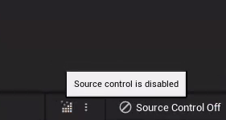
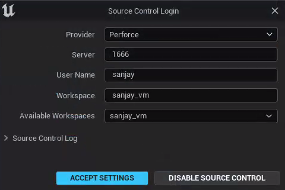

# Configuration

There are a few things we should configure in a new Unreal Project, so we'll do those first.

## Source Control

If you're working on the VM, you can connect Unreal to Perforce to allow Unreal to automatically check out files that you've changed. (If you're working locally, you don't want to do this because the Perforce server will be offline most of the time).

1. In the bottom right corner of the editor, click on the text that says "Source Control Off" to add a connection:

   
2. In the Source Control Login dialog, select Perforce, which should automatically populate the Server and User Name fields. Click the down arrow for Available Workspaces and you should be able to pick your local workspace, and accept settings that'll look something like this:
   
3. You should see a notification that the connection to source control was successful.

## Editor Preferences

Editor preferences are saved per machine, so you'll want to make these changes on any machine you're doing development on.

1. Go to Edit>Editor Preferences...
2. Type "hot reload" in the search box
3. Disable "Automatically Compile Newly Added C++ Classes" as this sometimes does not play nicely with the live coding feature we'll use
6. Close the Editor Preferences window

## Project Settings

Project settings end up being saved in either Config/DefaultGame.ini or Config/DefaultEngine.ini, depending on the settings you're changing. These will be synced in Perforce to everyone.

1. Go to Edit>Project Settings...
2. On the Project>Description page, change the Copyright Notice to the following format:
   
   `Copyright {Your Name} - {youremail}@usc.edu`
   
   For example my copyright notice was changed to:
   `Copyright Sanjay Madhav - madhav@usc.edu`
   
   This is mostly just so we can differentiate the code submissions easily.
3. Close the Project Settings window

## Committing Project Settings

If you're on the VM, you should notice that in P4V, you have this file checked out in your default changelist:

```
UnrealEngine/TopDown/Config/DefaultGame.ini
```

Go ahead and submit the changelist.

## Adding a .clang-format

A `.clang-format` file helps make sure that you're sticking with Unreal's coding standard (which is a criteria evaluated during code review). This type of file is recognized by Visual Studio and several other source code editors.

1. First, make sure Unreal and Visual Studio are closed
2. In Windows Explorer, browse to your your workspace's `UnrealEngine\TopDown\Source` directory
3. Right click and say New>Text Document
4. Rename this file `.clang-format` (without any `.txt` at the end)
5. Right click on the `.clang-format` and select "Open with" and tell Windows you want to open it with Notepad
6. Copy and paste the text from here into your `.clang-format`: [https://raw.githubusercontent.com/TensorWorks/UE-Clang-Format/main/.clang-format](https://raw.githubusercontent.com/TensorWorks/UE-Clang-Format/main/.clang-format)
7. Next, install the following [Visual Studio extension](https://marketplace.visualstudio.com/items?itemName=mynkow.FormatdocumentonSave), which will make it so the `.clang-format` settings are applied to every file when you save it.
8. Now reopen your UE5.sln file. When you start editing code, Visual Studio will show a dialog saying it found a clang format that it's going to use, and you can check the box to not show it again.

{: .warn}
Although `.clang-format` will help make sure you stick to the coding convention, it won't catch everything.

Since you added the `.clang-format` file manually, you will need to go into Perforce, browse to where your `.clang-format` file is, and mark it for add. Then submit the change.

Now it's time to start writing code and [add a HUD class](01-02.html).
