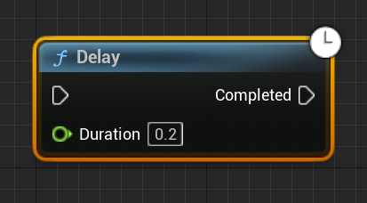
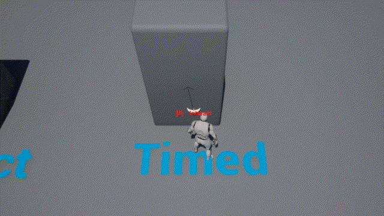

# Improving Interact

In this part of the assignment, you're going to significantly improve the interact functionality.

This part will mostly state the *expected design* of the features as opposed to providing implementation details. You will have to add new C++ functions and/or variables as appropriate to implement behaviors, as well as a handful of blueprint changes.

## Interact Glow

To make it more clear which object is the current "best candidate," add in a white glow effect for interactable objects. By default you can assume that the material parameter name is `"InteractGlow"` but give the option to change the parameter name in the interact component.

*Hint*: You should implement the behavior to set the material parameter value in C++ so that whenever you add an interact component to an actor, it'll automatically be setup to work assuming its material has an "InteractGlow" parameter.

You will have to modify the lamp material to get the glow to work on the existing `TorchInteract_BP` objects. To do this, can just take it's existing emissive color and add your glow parameter to it (it'll make it look really white but that's ok for testing).

## Interact Hint

Add a hint text that is centered on the best candidate. The text should say something along the lines of `"[E] - Interact"` to your HUD (you can just use an `FString` even though for a real game we'd want this to be localizable).

*Hint*: There's a `Project` function you can use to get a screen space position. To center the text, you'll have to take advantage of `GetTextSize`. 

## Improving Best Candidate Selection

Change the best candidate selection code so that it only picks a candidate that's "roughly" in front of the player and also within 200 units of the player. If there are multiple candidates that satisfy this criteria, you should pick the one that's closest to being directly in front of the player (eg. don't just pick the shortest distance).

{: .info }
In Unreal, the default units is centimeters. So, 200 units is 200cm or 2m.

## Example of Behavior

To demonstrate these improvements to interacting, add a puzzle component to TorchInteract_BP and place two torches near each other (so you can show how the candidate changes depending on your facing). Make it so a PuzzleLight only turns on when both torches are in their "on" state. Add a text render actor that says "Interact".

Here's an example of what's expected:

## Being Able to Enable/Disable Interaction

Right now if something has an Interact component, it's always enabled. Add a bool that can be set in Blueprint to enable/disable the interaction. If the interaction is disabled, the system should never select it as the "best candidate".

To demonstrate this, add a new `TimedTorchInteract_BP` that:

- Initially it's turned off and, you can interact with it
- When you interact it with it once, it turns on and you can't interact with it for the next X seconds (defaults to 2). After the X seconds are up, the torch should turn off and you should be able to interact with it again
- It also has a puzzle component whose output corresponds to the on/off state of the torch

To setup the "after X seconds" behavior, you can use a Delay node in the Blueprint, which will only execute the "Completed" pin after the duration passes:

{: .note }
The Delay node is what's called a "latent action" node in Blueprint (denoted by the clock in the top right corner). We'll discuss how these nodes work internally in a future lecture.

Hook up a TimedTorchInteract_BP to a PuzzleLight to demonstrate this behavior. Add a text render actor that says "Timed" near it.

## Adding Audio

We have a fire sound effect, so let's make the torches make the fire sound when they're on. To do this, add an Audio Component to both torch BPs. Use the `Fire01_Cue` looping sound that we imported from the starter content. Make sure the component isn't auto activated and set it active/inactive like we did with the particle system component.

Now that the interact system has been improved significantly, it's time to implement some [Morse code puzzles](03-02.html)!

