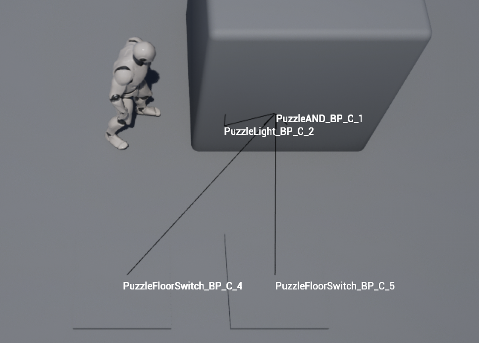

# Improving Debug Visualization

First, in `UPuzzleComponent::DebugDrawOutput`, add a call to `DrawDebugString` that draws the owner's name at its actor location. This text should draw regardless of whether or not an output actor is connected, as long as `IsRegistered()` returns true (without this check, it will crash).

This will look something like this in game:



## Adding a Console Command

Now we're going to add a console command to enable and disable this debug view (which we'll want disabled by default.

There's a very simple way to add "automatic" console variables. Add the following code to the global scope of TopDownHUD.cpp:

```c++
static TAutoConsoleVariable<int32> CVarDebugPuzzles(
	TEXT("DebugPuzzles"), // Console command
	0, // Default value
	TEXT("Turns puzzle debug view on/off (off by default)"), // Help text
	ECVF_Default); // Flags
```

Now in `DrawHUD`, only loop over all puzzle components if `CVarDebugPuzzles.GetValueOnGameThread() != 0`.

Now when you run, by default the debug visualization will be disabled.

To enable the debug visualization, while you're running in editor, click on the "Enter Console Command" bar at the bottom and type `DebugPuzzles 1` and press ENTER.

You can also bring up the console in game by pressing `~` and enter the command that way.

Once this is done, you're ready to [submit](03-04.html).

