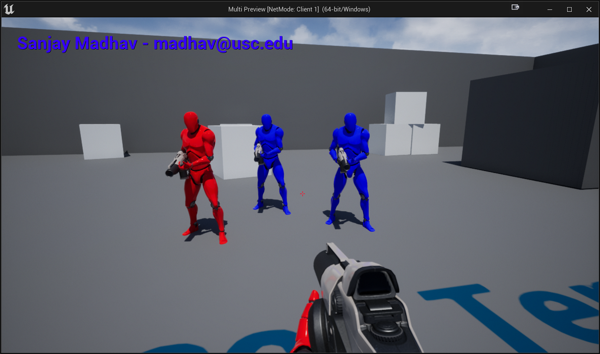
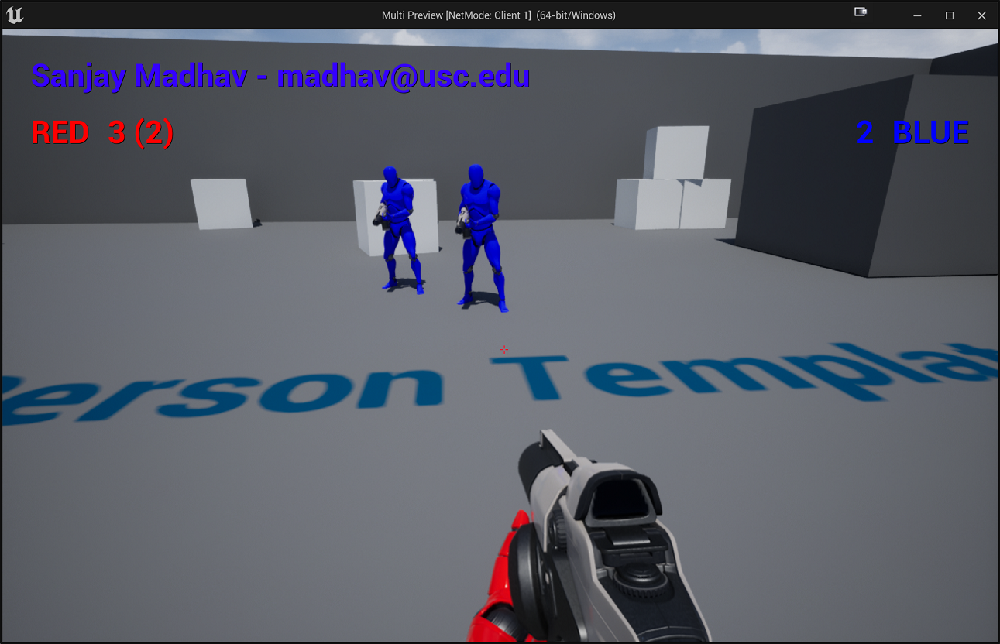
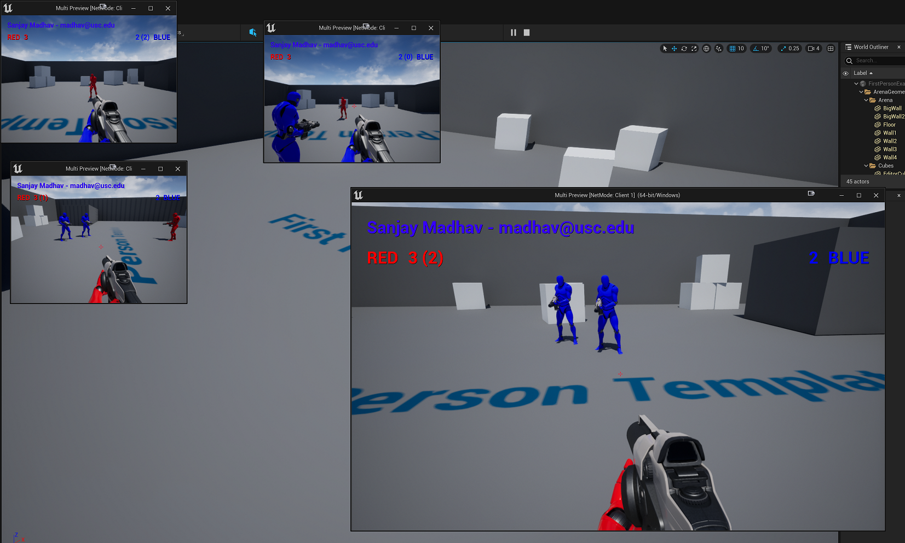

# Teams and Scoring

In this part, you'll make it so players are assigned to either the red or blue team, and their character models change to those colors based on their teams. Then, you'll make it so that every time you hit an opponent, your team gets a point.

The GameMode object which handles updating the game rules only exists on the server. In order to replicate any data that references the state of the game or players, you should use `AGameState` or `APlayerState` respectively. These _are_ replicated to all clients, so for example you can store individual player scores in the PlayerState or overall team scores and/or who's winning in the game state.

We want to make it so that when a player joins the game, they're assigned a team. That team should not change when they die/respawn, unless another game rule requires that the teams change. Because we want the team to persist, we're going to store the player's team in their PlayerState. We can't store it in the PlayerController because PlayerControllers are only replicated to the owning client, and PlayerControllers are also recreated when the player respawns.

## PlayerState Subclass and Team Enum

In editor, add a new C++ class that inherits from `PlayerState` and call it `MultiPlayerState`.

Rather than using an integer for the team, we're going to add a proper `UENUM` declaration for the team. We'll go ahead and put this in MultiPlayerState.h. So above the `UCLASS` declaration, add the following:

```c++
UENUM(BlueprintType)
enum class EMultiTeam : uint8
{
	/* Team not assigned yet*/
	None,
	/* On red team */
	Red,
	/* On blue team */
	Blue
};
```

Now add a public `UPROPERTY` of type `EMultiTeam` called Team to `AMultiPlayerState`. Make sure you mark it as `Replicated`, and initialize it to `None`. Remember you'll also need override `GetLifetimeReplicatedProps` and add a `DOREPLIFETIME` for it to actually get replicated (check the lecture notes for the syntax). You will need to include `"Net/UnrealNetwork.h"` as that's where `DOREPLIFETIME` is defined. 

Next, we need to tell `MultiGameMode` to use our new player state class. To do this, in the constructor of `AMultiGameMode`, set `PlayerStateClass` to reference our new type:

```c++
PlayerStateClass = AMultiPlayerState::StaticClass();
```

## Assigning Teams

The GameMode will be responsible for load balancing the teams. You'll need to track how many players are on each team in `MultiGameMode`. Then, in an override of `GenericPlayerInitialization`, first call the Super version and then check if that player already has a team assigned to their player state. If they don't, then you'll assign the player state a team based on the current number of players on each team (if it's a tie, add them to the red, otherwise add it to whichever has fewer players). `AController` has a handy templated `GetPlayerState` function that you can use to retrieve the player state, if it's associated with one.

To test that this works, you could add a breakpoint to your `GenericPlayerInitialization`. Then change your PIE settings so that there's a total of 4 players instead of just 2. You should see the players get assigned teams in the order of red, blue, red, blue.

## Showing Team Colors on Characters

Next, you also want to visualize the red/blue team colors on the MultiCharacter themselves. To do this, you'll have to add a `ReplicatedUsing` `UPROPERTY` to MultiCharacter for the team. Don't forget to override `GetLifetimeReplicatedProps`. In your RepNotify function, set the `"BodyColor"` vector parameter on both the `Mesh1P` and `Mesh3P` meshes to the correct color for that team (you can look at how you did that in TopDown for reference).

By using the notification function, when the client finds out about the team they'll update the color properly. The server will then need to update the character's team in the override of `OnPossess` in `MultiPlayerController` (getting the correct team from the player state).

If this works properly, you should now see that with four players, two player characters are red and two are blue:



## Adding Score to GameState

As mentioned earlier, you'll want to track the team's scores in the GameState. Add a new C++ class that inherits from `GameStateBase` called `MultiGameStateBase`.

In here, add two floats for the red team and blue team score respectively, and these should be replicated. Then override `GetLifetimeReplicatedProps`.

You then need to tell MultiGameMode to use `AMultiGameStateBase` as the `GameStateClass`.

The PlayerState class already has a `Score` member variable, so we don't need to add one to MultiPlayerState.

## Instigator and Adding Points

Right now, when MultiCharacter spawns a projectile, it doesn't associate it with who spawned it. Unreal calls this the `Instigator`. This is a variable you can access on any actor. In the `FActorSpawnParams` struct that's passed into `SpawnActor`, you can specify who the `Instigator` is. In this case, it should be just `this` as they're the character spawning the projectile.

Next, change `AMultiProjectile::OnHit` so it does nothing if not local role authority (otherwise it'll trigger for the proxies, as well, which you don't want).

Then, add code that checks if the `OtherActor` is a `AMultiCharacter`, in which case you may need to update the score:

- If the `OtherActor` is on the same team as the Instigator, nothing should happen (you have to use `GetInstigator()` to get that pawn, and then get the player state from that with the templated `GetPlayerState`)
- If the `OtherActor` is on the opposite team of the Instigator, then the Instigator's PlayerState should get 1 point, and the correct team in the GameState should also get 1 point. To get the GameState, there's a templated `GetGameState` function you can call on the World.

Then, make sure you `Destroy()` the projectile (so it won't bounce further after hitting the player).

{: .warning }
Because of the way the spawning/collision works right now, if you stand right on an opponent and fire the projectile it may not trigger the `OnHit`. We'll potentially fix this in a later assignment.

Before moving onto the next part, I would suggest temporarily adding a `UE_LOG` statement every time the game state's score changes so you can verify the score is changing properly.

## Adding Scores to the HUDWidget

Now, add text block elements to HUDWidget that show the red team and blue team score. The red team score should show up near the top left, and the blue team score near the top right, and they should show in red and blue respectively. Also, based on the team that player is on, it should show in parenthesis that player's individual score.

Remember, that because you're only making the HUDWidget on each client, you can just get player controller index 0 like you would normally, and that's guaranteed to be the correct local player for that client. The additional indices are only used for local multiplayer.

For example, suppose you're on the red team and your team has 3 points (of which you're responsible for 2), and the blue team has 2 points, that player's HUDWidget would show this:



In this case, you should also verify that all your other player's HUDWidgets also match the expected state:



{: .info }
You may notice there's a slight delay as to when your player score increases relative to the team score. This is because the `NetUpdateFrequency` is set to 1 for PlayerState, which means it'll update no more than once per second. If you increased it to 2 or 4, the latency would not be perceptible.

In [part 3](08-03.html), you'll implement an ammo count for the player.
